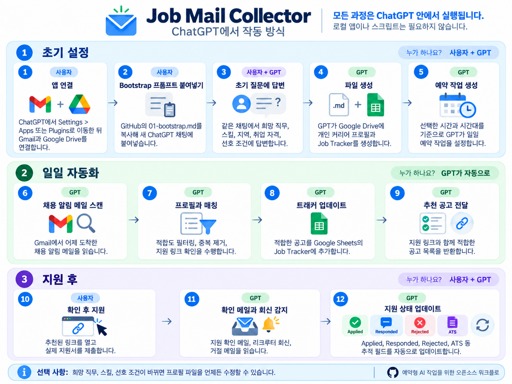

[English](README.md) | [한국어](README.ko.md)

# Job Mail Collector

Job Mail Collector는 Gmail로 받은 채용 알림 메일을 읽고, 개인 커리어 프로필과 비교해 적합한 공고를 선별하고, 허용된 경우 Google Sheets 트래커에 기록하며, 지원 링크를 ChatGPT 안에서 반환하는 재사용 가능한 ChatGPT 예약 작업 워크플로입니다.

공개 저장소에는 워크플로 로직과 템플릿만 포함됩니다. 각 사용자의 커리어 프로필, 이메일 데이터, 지원 이력은 해당 사용자의 연결된 Google 계정 안에만 남습니다.



> 제품 동작, 연결 가능한 앱, 예약 작업 기능은 변경될 수 있습니다. OpenAI 문서 기준 마지막 확인일: 2026-09-08.

## 사용자가 실제로 하는 일

처음 사용하는 사람은 아래 네 가지만 하면 됩니다.

1. ChatGPT에 Gmail과 Google Drive를 연결합니다.
2. 이 저장소의 `prompts/01-bootstrap.md`를 복사해 새 ChatGPT 대화에 붙여넣습니다.
3. 같은 대화에서 ChatGPT가 묻는 온보딩 질문에 답합니다.
4. ChatGPT가 추천한 링크를 열어 실제로 지원합니다.

필요한 권한이 있는 경우 나머지는 ChatGPT가 처리합니다.

### 온보딩은 한 번에 질문 하나씩 진행됩니다

Bootstrap 프롬프트는 비개발자도 사용할 수 있도록 설계되어 있습니다.

ChatGPT는:

- 한 턴에 질문을 정확히 하나만 합니다.
- 각 질문이 `필수`인지 `선택`인지 표시합니다.
- 선택 질문은 건너뛸 수 있다고 알려줍니다.
- 생소한 개념은 쉬운 말로 설명합니다.
- 필요하면 예시를 제공합니다.
- 기술적인 설정에는 추천 기본값을 우선 사용합니다.
- 내부 데이터 용어를 설명 없이 사용자에게 노출하지 않습니다.

예를 들어 `목표 seniority가 무엇인가요?`라고 묻는 대신 `어느 정도 직급이나 경력 수준의 공고를 찾고 있나요?`라고 묻습니다.

또한 사람을 직접 관리하는 People Management와 프로젝트 리드, 멘토링, 디자인 방향 설정 같은 Leadership 경험을 서로 다른 개념으로 다룹니다.

질문 설계 전체는 `docs/profile-questionnaire.md`, 사용자와 GPT의 역할 구분은 `docs/user-flow.md`에서 확인할 수 있습니다.

## Gmail과 Google Drive 연결 위치

ChatGPT에서 계정 화면에 따라 `Settings > Apps` 또는 `Settings > Plugins`로 이동합니다. 채용 알림 메일을 받는 Google 계정과 Job Mail Collector에서 사용할 Drive가 있는 계정을 연결합니다.

앱을 연결한 뒤에는 일반 ChatGPT 대화에서 Bootstrap 프롬프트를 실행합니다. 로컬 프로그램, 터미널 명령어, Python 스크립트, GitHub Action을 실행할 필요가 없습니다.

## 최초 1회 설정

1. ChatGPT에 Gmail과 Google Drive를 연결합니다.
2. GitHub에서 `prompts/01-bootstrap.md`를 엽니다.
3. 프롬프트 전체를 복사해 새 ChatGPT 대화에 붙여넣습니다.
4. ChatGPT가 쉬운 표현으로 질문을 한 번에 하나씩 합니다.
5. 사용자가 같은 대화에서 각 질문에 답합니다.
6. ChatGPT가 연결된 Google Drive에 개인 커리어 프로필과 새 Google Sheet Tracker를 생성합니다.
7. 기존 지원 이력이 있다면 선택적으로 새 Tracker에 가져올 수 있습니다.
8. ChatGPT가 사용자가 선택한 시간에 반복 실행되는 예약 작업을 생성합니다.
9. 설정이 완료되기 전에 ChatGPT가 검증 테스트를 실행합니다.

이 프로젝트를 처음 사용하는 데 기존 Tracker는 필요하지 않습니다.

설정이 끝난 뒤 생성된 프로필이나 Tracker 파일을 사용자가 직접 만들거나 옮길 필요도 없습니다. ChatGPT가 연결된 Drive에 생성하고 이후에도 해당 파일을 참조합니다.

### 기존 지원 이력은 선택 사항입니다

Job Mail Collector는 최초 접근 확인 단계에서 사용자의 Drive를 뒤져 기존 Tracker를 임의로 선택하지 않습니다.

사용자가 과거 지원 이력을 가져오고 싶다고 명시한 경우에만 기존 Tracker를 찾을 수 있고, 호환 가능한 이력을 새 `Job_Mail_Collector` Tracker로 가져옵니다.

기존 Tracker가 없어도 아무 문제 없이 새 빈 Tracker로 설정을 계속합니다.

## 일일 자동화

예약된 시간이 되면 ChatGPT가 자동으로 다음 작업을 수행합니다.

1. 사용자의 비공개 커리어 프로필을 불러옵니다.
2. Gmail에서 설정된 채용 알림 메일을 읽습니다.
3. Digest 형식의 메일을 개별 공고로 분리합니다.
4. 가능한 경우 회사, 직무, 지역, 급여, 근무 형태, 출처, 지원 링크를 추출합니다.
5. 명백한 비적합 공고와 중복 공고를 제거합니다.
6. 남은 공고를 사용자의 프로필과 비교합니다.
7. Google Drive 쓰기 권한이 허용되면 적합한 새 공고를 Tracker Sheet에 기록합니다.
8. 예약 작업 결과에서 가장 적합한 공고와 지원 링크를 반환합니다.
9. 명확한 지원 확인 메일과 회사 또는 리크루터 회신을 확인합니다.
10. 근거가 명확하면 Tracker 상태 필드를 자동으로 업데이트합니다.
11. 사람이 확인해야 하는 사항은 별도로 보고합니다.

기본 이메일 확인 범위는 선택한 시간대 기준 전날 00:00부터 23:59까지입니다. 사용자가 다른 범위를 원하는 경우에만 별도로 설정합니다.

### 자동화되지 않는 것

실제 지원서 제출은 일반적으로 사용자가 회사 채용 페이지, ATS, LinkedIn, Indeed 등 외부 지원 페이지에서 직접 진행합니다.

Job Mail Collector는 지원 확인 메일 같은 근거가 있거나 사용자가 직접 Tracker를 수정한 경우가 아니라면 지원 완료라고 판단하지 않습니다.

지원 확인 메일이 오지 않는 경우에는 사용자가 해당 행을 `Applied`로 직접 변경해야 할 수 있습니다.

## Tracker 자동 업데이트와 fallback

기본 동작은 Tracker 자동 기록입니다.

Google Drive 쓰기 작업이 가능하고 권한이 허용된 경우 예약 작업은 다음을 수행합니다.

- 새 적합 공고를 `Candidate` 상태로 추가합니다.
- 명확한 지원 확인 메일이 오면 해당 행을 `Applied`로 변경합니다.
- 회사 또는 리크루터의 명확한 회신이 오면 `RespondedAt`을 기록합니다.
- 근거가 충분한 경우 거절 결과와 거절 단계를 기록합니다.
- 애매한 경우 추측하지 않고 사람이 확인하도록 남깁니다.

일부 ChatGPT 계정이나 관리형 워크스페이스에서는 외부 데이터 변경 전에 승인이 필요할 수 있습니다. 예약 실행 중 쓰기 작업이 승인 없이 진행될 수 없다면 조용히 실패해서는 안 됩니다. 대신 변경 예정 내용을 바로 붙여넣을 수 있는 TSV 형식으로 반환하고 Tracker 쓰기 승인이 불가능했다고 명확히 알려야 합니다.

## 개인 데이터 구조

이 워크플로는 사용자가 소유하는 두 개의 비공개 리소스를 사용합니다.

### 1. 커리어 프로필

권장 파일명:

`Job_Mail_Collector_Profile.md`

주요 내용:

- 경력 배경
- 희망 직무와 직급 또는 경력 수준
- 관련 스킬과 경험
- 선호 및 제외 도메인
- 지역 및 근무 형태 조건
- 취업 자격 및 스폰서십 조건
- 회사 및 키워드 선호
- 공고 매칭에 사용하는 정량적 성과와 근거
- People Management와 구분된 Leadership 경험

raw Markdown 파일을 직접 생성하거나 읽는 기능이 지원되지 않는 경우, ChatGPT가 동일한 Markdown 내용을 담은 비공개 Google Doc을 생성하고 해당 문서 참조를 Sheet 설정에 저장합니다.

### 2. Tracker Sheet

기본 이름:

`Job_Mail_Collector`

탭:

- `Config`: 운영 설정과 자동화 모드
- `Sources`: 확인된 Gmail 채용 알림 발신자
- `Tracker`: 채용 후보와 지원 이력
- `Control`: 읽기 완전성 검증

새 Tracker는 최초 설정 중 자동으로 생성됩니다.

커리어 프로필이 매칭 판단의 기준입니다. Sheet에는 사용자의 전체 경력 내용을 중복 저장하지 않습니다.

## 핵심 기능

- 한 번에 질문 하나씩 진행하는 대화형 온보딩
- 필수/선택 표시와 쉬운 설명
- 비공개 커리어 프로필 생성
- 새 Google Sheet Tracker 자동 생성
- 기존 지원 이력 선택적 가져오기
- Gmail 채용 알림 소스 탐색 및 확인
- 반복 Scheduled Task 생성
- Digest 메일 분리
- 하드 필터링과 소프트 매칭
- 존재하지 않는 URL을 만들지 않는 지원 링크 추출
- 현재 실행과 기존 이력을 모두 고려한 중복 제거
- 권한이 있을 때 Tracker 자동 기록
- 지원 확인 메일 감지
- 회사 및 리크루터 회신 감지
- 무응답 경과 확인
- 근거가 있을 때 거절 단계 추정
- 확인 가능한 발신 도메인을 이용한 ATS 추정
- 불완전한 읽기, 권한 누락, 파싱 실패, 애매한 근거에 대한 진단

## 저장소 구조

```text
job-mail-collector/
├── LICENSE
├── README.md
├── README.ko.md
├── .gitignore
├── job-mail-collector-flow.png
├── job-mail-collector-flow-ko.png
├── prompts/
│   ├── 01-bootstrap.md
│   ├── 02-daily-job-mail-collector.md
│   ├── 03-test-run.md
│   └── 04-update-profile.md
├── profiles/
│   └── profile.template.md
├── docs/
│   ├── user-flow.md
│   ├── architecture.md
│   ├── profile-file.md
│   ├── profile-questionnaire.md
│   ├── sheet-schema.md
│   ├── matching-rules.md
│   └── troubleshooting.md
└── examples/
    ├── profile.example.md
    ├── sources.example.tsv
    └── output.example.md
```

## 설계 원칙

- **ChatGPT 중심 온보딩.** 처음 사용하는 사람이 내부 스키마를 먼저 이해할 필요가 없어야 합니다.
- **한 번에 질문 하나.** 여러 질문을 한꺼번에 던지지 않습니다.
- **내부 용어보다 쉬운 표현 우선.** 기술적인 필드명은 내부에서만 사용합니다.
- **필수와 선택을 명확히 표시.** 사용자가 무엇을 건너뛸 수 있는지 알 수 있어야 합니다.
- **People Management와 Leadership을 구분.** 프로젝트 리드나 멘토링만으로 사람 관리 경험이 있다고 판단하지 않습니다.
- **새 Tracker를 자동 생성.** 기존 이력은 사용자가 명시적으로 원할 때만 가져옵니다.
- **개인 프로필은 공개 프롬프트 밖에 보관.** 커리어 데이터는 사용자가 소유하는 Drive 리소스에 저장합니다.
- **지원 링크를 임의로 생성하지 않음.** 링크가 없거나 읽을 수 없으면 빈칸으로 둡니다.
- **하드 필터를 매칭보다 먼저 적용.** 명백한 제외 조건은 다른 높은 적합도 점수로 뒤집지 않습니다.
- **모든 판단에 근거 사용.** 매칭, 제외, 상태 변경은 이메일, 공고, 프로필, Tracker 중 확인 가능한 근거로 설명할 수 있어야 합니다.
- **부분 데이터로 부재를 판단하지 않음.** Tracker 전체 읽기가 검증되지 않으면 Tracker 기반 판정을 중단합니다.
- **자동 쓰기와 안전한 fallback.** 권한이 있으면 Tracker에 직접 쓰고, 예약 쓰기가 불가능하면 TSV를 반환합니다.
- **지원 상태를 추측하지 않음.** 지원 및 회신 상태 변경에는 명확한 근거가 필요합니다.
- **설정은 예약 프롬프트 밖에서 관리.** 사용자는 일일 로직을 다시 작성하지 않고도 프로필과 운영 설정을 바꿀 수 있습니다.

## 버전 정보

현재 저장소 구조:

- `config_version = 3`
- `profile_version = 1`

이번 변경은 온보딩 대화 방식만 개선하고 Sheet 및 프로필 스키마는 바꾸지 않으므로 config version은 그대로 유지합니다.

## OpenAI 참고 문서

- Scheduled Tasks: https://help.openai.com/en/articles/10291617
- 앱 계정 연결 및 관리: https://help.openai.com/en/articles/20001494-connecting-and-managing-app-accounts-in-chatgpt
- Google Drive 앱 설정: https://help.openai.com/en/articles/10929079
- Google 앱 데이터 제어: https://help.openai.com/en/articles/10408842-google-app-data-controls-faq

## 라이선스

별도 표기가 없는 한 이 저장소의 원본 프롬프트, 문서, 예시, 템플릿은 **Creative Commons Attribution 4.0 International (CC BY 4.0)** 라이선스를 따릅니다.

적절한 출처를 표시하고, 라이선스 링크를 제공하며, 변경 사항을 명시하는 조건으로 상업적 이용을 포함한 공유와 수정이 가능합니다.

권장 출처 표기:

> Job Mail Collector by Aiden, licensed under CC BY 4.0.

자세한 내용은 `LICENSE` 및 https://creativecommons.org/licenses/by/4.0/ 를 참고하세요.
