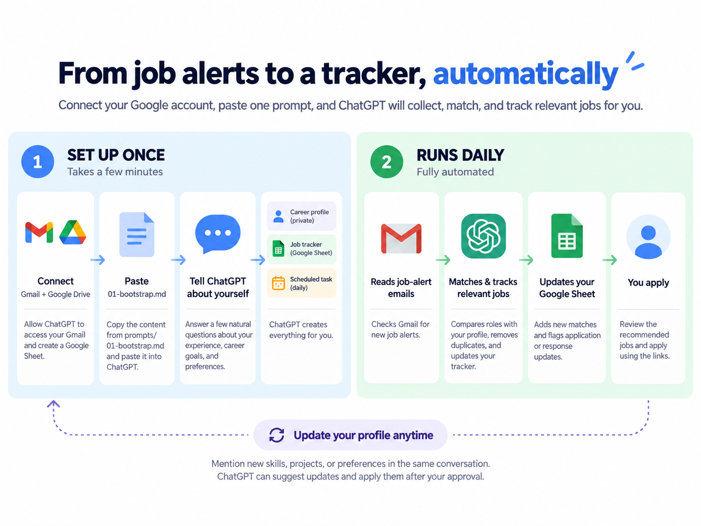

[English](README.md) | [한국어](README.ko.md)

# Job Mail Collector

Job Mail Collector is a reusable ChatGPT Scheduled Task workflow that reads job-alert emails from Gmail, matches postings against a private career profile, writes suitable jobs into a Google Sheet tracker when permitted, and returns application links in ChatGPT.

The public repository contains only workflow logic and templates. Each user's career profile, email data, and application history stay in that user's connected Google account.



> Product behavior, available apps, and Scheduled Task capabilities can change. Last verified against OpenAI documentation: 2026-09-08.

## What the user actually does

A new user only needs to:

1. Connect Gmail and Google Drive to ChatGPT.
2. Copy `prompts/01-bootstrap.md` into a new ChatGPT conversation.
3. Answer the onboarding questions naturally.
4. Open recommended job links and submit applications on the employer's site.

Everything else is handled by ChatGPT when the required permissions are available.

## Onboarding is a conversation, not a form

Users do not need to know the internal schema or give one exact value per question.

A fictional example answer can look like this:

> I am mainly looking for Senior Data Analyst roles, but Analytics Engineer or BI Lead roles are also interesting when the actual work fits. I have about six years of experience, with the last three focused on logistics and operations analytics.

ChatGPT extracts all useful information from the answer and skips questions that are already resolved.

Public examples in this repository are intentionally fictional. They should not be generated from a user's private career profile, prior conversations, or Memory.

The onboarding follows these rules:

- one question per turn;
- free-form answers are accepted;
- examples are shown when a question may be hard to answer;
- examples are illustrative, not a required format;
- normal questions are not labeled `Required`;
- only optional questions are marked;
- optional questions clearly say they can be skipped;
- factual career evidence is collected before narrow filters;
- technical settings use recommended defaults whenever possible.

For experienced users, a title alone is not enough. The onboarding asks role-specific depth questions when needed to understand actual ownership, problem-solving strengths, impact, decision-making, cross-functional influence, leadership, process improvements, and differentiating expertise.

## Setup progress is visible

The user should not have to wonder when onboarding will end.

The setup is divided into four visible stages:

1. **Career direction & evidence**
2. **Search constraints**
3. **Automation & job-alert sources**
4. **Schedule, create, and test**

Most setups take about **8-12 user answers** when recommended settings are used. A detailed answer can cover several topics and reduce the remaining count.

Before each direct onboarding question, ChatGPT shows a compact progress line such as:

`Setup progress: 1/4 - Career direction & evidence - about 7-10 answers remaining`

The range is recalculated as information is collected. Permission dialogs and approval clicks are not counted as onboarding answers.

## Fit is based on actual scope, not title labels alone

A stated target title or career level is an anchor, not automatically a whitelist.

For example, a user mainly targeting `Senior Data Analyst` may still receive an `Analytics Engineer` or `BI Lead` role when the actual responsibilities and required scope are supported by the user's evidence.

Internally, the workflow treats roles as:

- **Core target**: the main direction
- **Consider if fit**: nearby titles or broader levels worth evaluating when actual scope fits
- **Hard exclude**: roles or conditions the user explicitly does not want

For experienced users, a Strong match should normally have a meaningful reason beyond exact title similarity.

## One-time setup

1. Connect Gmail and Google Drive in ChatGPT.
2. Open `prompts/01-bootstrap.md`.
3. Paste the full prompt into a new ChatGPT conversation.
4. ChatGPT collects career evidence and matching preferences conversationally, with visible setup progress.
5. ChatGPT creates a private career profile.
6. ChatGPT creates a **brand-new** Google Sheet Tracker using Job Mail Collector's schema.
7. ChatGPT discovers or collects Gmail job-alert sources and asks the user to confirm them.
8. ChatGPT creates the recurring Scheduled Task.
9. ChatGPT runs a validation test.

No local program, Python script, terminal command, server, or GitHub Action is required.

## Always start with a fresh Tracker

Bootstrap intentionally does **not** ask whether the user already has a spreadsheet or tracker.

It does not search for, import, adapt, merge, or reuse an existing tracker. A fresh bot-native Sheet avoids relying on arbitrary column layouts, formulas, or status semantics that may not be compatible with the workflow.

Preferred Sheet name:

`Job_Mail_Collector`

If that name already exists, ChatGPT creates a uniquely named new Sheet such as `Job_Mail_Collector_2` instead of asking to reuse the existing file.

If a user wants historical application data migrated, that should be done separately in another ChatGPT conversation after setup. This keeps bootstrap predictable and avoids silently corrupting an existing tracker.

This does not disable ongoing missing-application detection. Scheduled runs can still create an Applied row when clear Gmail evidence proves an application occurred.

## Private career profile

Preferred name:

`Job_Mail_Collector_Profile.md`

If direct raw Markdown creation or reading is unavailable, ChatGPT can use a private Google Doc containing the same Markdown text.

The profile stores:

- career background
- search direction
- nearby roles to consider when actual fit is strong
- differentiators and actual ownership scope
- skills and specialty areas
- measurable outcomes
- leadership evidence
- domains and constraints
- work authorization and sponsorship handling
- explicit hard exclusions and warnings

The current profile schema uses `profile_version = 2`.

Resume-version tracking is intentionally not part of the core profile.

## Tracker Sheet

Tabs:

- `Config`
- `Sources`
- `Tracker`
- `Control`

The Tracker contains exactly 13 columns:

```text
Status
Company
Title
Location
Salary
WorkMode
Notes
Link
ReceivedAt
AppliedAt
RespondedAt
Result
Source
```

The following fields were intentionally removed to keep the workflow focused:

- ATS
- ResumeVersion
- Channel
- RejectionStage

`Source` is the single provenance field. If recruiter or agency context matters for a specific row, that information can go in `Notes`.

`ReceivedAt` is retained because users may review or apply to an opportunity several days after it was first discovered.

The current operational schema uses `config_version = 4`.

## Missed-run recovery

The workflow does not assume the task ran successfully every day.

`Control.last_successful_scan_date` records the last local calendar date that was fully processed.

On each run:

- first run: process the previous local calendar day;
- later runs: process every unprocessed local calendar day through yesterday;
- if a task was skipped or failed, the next successful run catches up automatically.

The scan period is shown at the top of the Scheduled Task result.

The success marker advances only after the full target period was processed with the required profile, Tracker, Gmail source searches, and output completed. A blocked Sheet write can still count as processed when the task returns a complete explicit TSV fallback.

## Message classification

A sender address does not define one permanent message type.

The same sender can send a job alert, application confirmation, or another kind of message.

Job Mail Collector classifies relevant messages using:

- sender
- subject
- body

Useful categories include:

- job alert
- application confirmation
- recruiter submission evidence
- employer or recruiter response
- marketing/newsletter
- unknown

This prevents application-confirmation mail from being treated as a new candidate simply because it came from a known job-alert sender.

## Daily automation

At the scheduled time, ChatGPT should:

1. calculate the catch-up scan period;
2. load Config, Control, Sources, and the private career profile;
3. verify Tracker read completeness;
4. read enabled job-alert sources for the full target period;
5. expand digest emails into individual jobs;
6. classify messages before deciding how to use them;
7. extract job information and application links without inventing missing URLs;
8. deduplicate current-run postings;
9. apply explicit hard exclusions;
10. judge actual job fit using career evidence and differentiators;
11. compare with verified Tracker history;
12. reconcile clear application and response evidence;
13. write Tracker changes when permitted;
14. return a shortlist, source health, human-review items, and diagnostics;
15. advance the successful-scan marker only after core processing succeeds.

## Single-pass application and response reconciliation

When application or response detection is enabled, the workflow avoids running a separate Gmail search for every Applied company.

Instead, it reads messages from the target period in one broad inbox pass, classifies likely confirmations, recruiter submissions, and employer/recruiter replies, then compares those messages with relevant Tracker rows.

A targeted follow-up search is used only when a specific ambiguity needs resolution.

Clear application evidence can include:

- an explicit application-confirmation email;
- an explicit recruiter statement that the user's application, profile, or resume was submitted or forwarded for a specific company and role.

Ambiguous future-intent statements do not trigger automatic updates and go to Human review.

## Tracker completeness safety

Before the task says that a job or application is absent from Tracker, it verifies that the number of Tracker rows actually read matches `Control.tracker_data_rows`.

If the read is incomplete, the task does not make absence-based claims, does not confirm historical duplicates, does not reconcile application state, and does not advance `last_successful_scan_date`.

## Company identity safety

The workflow does not guess a parent company from an unfamiliar subsidiary, brand, or legal entity name.

If two records look related but company identity cannot be verified confidently, they are treated as a suspected duplicate for Human review instead of being merged automatically.

## Application status tracking

Clear evidence can update:

- `Status = Applied`
- `AppliedAt`
- `RespondedAt`
- `Status = Closed`
- `Result = Rejected` or another explicit final outcome

The workflow intentionally does not store ATS platform or rejection-stage inference.

If no confirmation or recruiter-submission evidence exists, the user may need to mark an application as Applied manually.

## No-response monitoring

When enabled, the workflow flags Applied rows with no response after the configured number of days, recommended default 14 days.

No-response rows are not automatically closed by default.

## Source health

Every run reports enabled alert sources with their message counts, including sources that received zero messages.

If all major configured sources unexpectedly return zero messages, the task warns that job-alert delivery, sender patterns, or account configuration may need review.

## Automatic Tracker writes and fallback

When Google Drive write actions are available and authorized, ChatGPT writes suitable candidates and clear status changes directly to Tracker.

If a scheduled write cannot proceed because approval is required or the write action is unavailable, the task returns the intended changes as exact 13-column TSV and clearly says the write was not applied.

## Repository structure

```text
job-mail-collector/
├── LICENSE
├── README.md
├── README.ko.md
├── .gitignore
├── job-mail-collector-flow.png
├── job-mail-collector-flow-ko.png
├── prompts/
│   ├── 01-bootstrap.md
│   ├── 02-daily-job-mail-collector.md
│   ├── 03-test-run.md
│   └── 04-update-profile.md
├── profiles/
│   └── profile.template.md
├── docs/
│   ├── user-flow.md
│   ├── architecture.md
│   ├── profile-file.md
│   ├── profile-questionnaire.md
│   ├── sheet-schema.md
│   ├── matching-rules.md
│   └── troubleshooting.md
└── examples/
    ├── profile.example.md
    ├── sources.example.tsv
    └── output.example.md
```

## Design principles

- **Conversation, not configuration forms.** Users answer naturally.
- **Visible progress.** Users can see the current setup stage and an approximate remaining-answer range.
- **Understand the person before narrowing the search.** Experienced candidates need evidence beyond title and years.
- **Actual scope over title labels.** Plausible nearby roles stay open unless explicitly excluded.
- **Fresh Tracker every setup.** Bootstrap never adapts an arbitrary existing spreadsheet.
- **Keep only useful tracking fields.** ATS, ResumeVersion, Channel, and RejectionStage are not part of the core Tracker.
- **Recover missed runs.** A failed scheduled day should not silently lose opportunities.
- **Classify messages by content.** Sender address alone is insufficient.
- **Single-pass reconciliation.** Avoid repeated per-company Gmail searches when one inbox pass can do the job.
- **No fabricated links or company relationships.** Unknown stays unknown.
- **No absence claims from partial Tracker reads.** Completeness is verified first.
- **Automatic writes with a safe fallback.** Use exact TSV when scheduled writes cannot be applied.
- **No invented application state.** Status changes require clear evidence.

## Versioning

Current versions:

- `config_version = 4`
- `profile_version = 2`

The latest onboarding changes do not alter either schema version.

## OpenAI references

- Scheduled Tasks: https://help.openai.com/en/articles/10291617
- Connecting and managing app accounts: https://help.openai.com/en/articles/20001494-connecting-and-managing-app-accounts-in-chatgpt
- Google Drive app setup: https://help.openai.com/en/articles/10929079
- Google app data controls: https://help.openai.com/en/articles/10408842-google-app-data-controls-faq

## License

Except where otherwise noted, the original prompts, documentation, examples, and templates in this repository are licensed under **Creative Commons Attribution 4.0 International (CC BY 4.0)**.

Suggested attribution:

> Job Mail Collector by Aiden, licensed under CC BY 4.0.

See `LICENSE` and https://creativecommons.org/licenses/by/4.0/ for details.